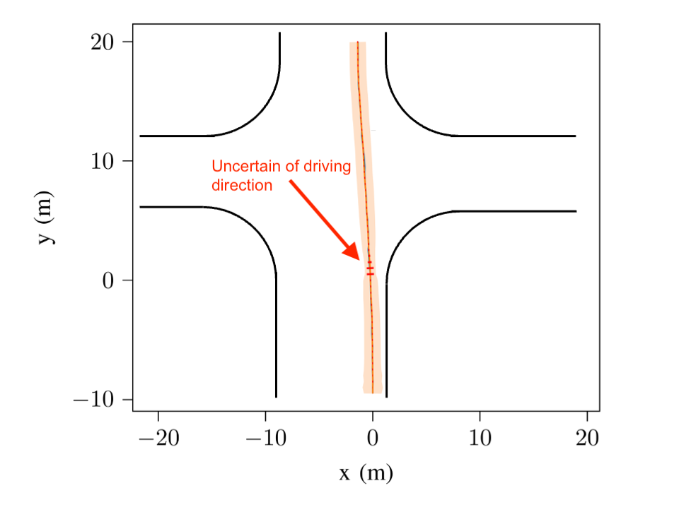
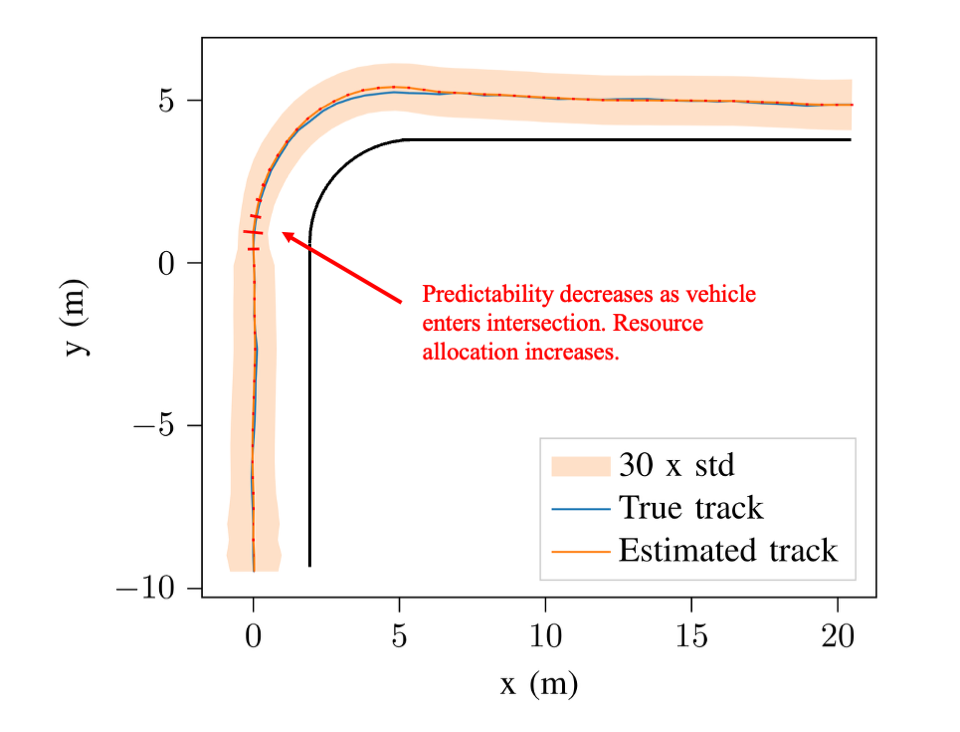

# Communication Scheduling by Deep Reinforcement Learning for Remote Traffic State Estimation with Bayesian Inference


[](https://doi.org/10.1109/TVT.2022.3145105)

This repository accompanies the paper "Communication Scheduling by Deep
Reinforcement Learning for Remote Traffic State Estimation with Bayesian
Inference" (Bile Peng, Yuhang Xie, Gonzalo Seco-Granados, Henk Wymeersch, and
Eduard A. Jorswieck, IEEE Transactions on Vehicular Technology, vol. 71,
no. 4, pp. 4287–4300, April 2022, [doi:
10.1109/TVT.2022.3145105](https://doi.org/10.1109/TVT.2022.3145105)).

## The problem in one sentence

**Decide, moment by moment, how much communication resource to spend on a
moving vehicle — spend a lot when its behavior is hard to predict, spend
little when it isn't.**

## The setup, in plain terms

A roadside unit tracks a vehicle and regularly sends its estimated
position to nearby vehicles, so they know where it is without needing a
direct line of sight. This estimate is produced with standard Bayesian
inference techniques for tracking moving objects. Every time the estimate
is sent, there is a cost (transmission power), and there is a risk that the
message doesn't arrive.

The interesting part is: **how much you should spend at any given moment
depends on how predictable the vehicle currently is.** A car cruising
straight down a highway barely needs updating — its next position is easy
to guess. A car approaching an intersection is a different story: it might
go straight, it might turn, and until that becomes clear, any prediction
made without a fresh update can be badly wrong. A fixed, one-size-fits-all
schedule can't handle both situations well — it either wastes resources
when things are predictable, or under-delivers when they aren't. This is
exactly the kind of situation where a learned, state-dependent policy beats
a hand-designed rule.

## Solving it with RL

This is where reinforcement learning comes in, and where most of my
contribution to this work sits:

- **State**: at every moment, the agent is given a compact summary of how
  confident the tracking system currently is about the vehicle — is its
  belief about the vehicle's motion converging, or is it uncertain and
  possibly out of date?
- **Action**: how much transmission power to use right now (a continuous
  value).
- **Reward**: I designed the reward to directly encourage low resource
  usage, while imposing a steep penalty whenever tracking accuracy drops
  below an acceptable level. This turns "minimize cost subject to an
  accuracy constraint" — normally a constrained optimization problem — into
  a plain reward signal that an off-the-shelf RL algorithm can optimize
  directly, without needing a specialized constrained solver.
- **Algorithms**: I trained and compared two modern RL algorithms —
  Proximal Policy Optimization (PPO, on-policy) and Soft Actor-Critic (SAC,
  off-policy, entropy-regularized) — using Stable-Baselines3. SAC
  consistently reached the same accuracy guarantee with less total
  resource spend, and needed far fewer environment interactions to get
  there. That sample-efficiency gap is worth highlighting on its own: in
  many real systems, each environment interaction is expensive (a physical
  measurement, a test, a production step), so an algorithm that learns a
  good policy from fewer interactions is often the more practical choice,
  independent of its final performance.

## What the learned policy actually does

The two figures below show the trained agent in action at an intersection.
The orange band shows how uncertain the tracking estimate currently is
(wider = less confident); the red bars mark how much resource the agent
chose to spend at that point along the track.

**Case 1 — outside the intersection.**
The road ahead is unambiguous and the prediction of vehicle state
based on its previous estimates is quite accurate.
The agent quickly learns it can reduce allocated resource without
degrading estimation accuracy significantly. 
The red bars stay short, and the
uncertainty band stays narrow throughout.

**Case 2 — approaching the intersection.**
Before the intersection, the vehicle could go straight or turn — the
agent has no way to be sure and the prediction accuracy drops significantly. 
In response, it sharply raises its resource
spend exactly during this ambiguous window, keeping the tracking accurate
while the outcome is still unresolved. Once the
vehicle's path is predictable again (whether it goes straight or turns), 
the agent relaxes and lowers its spend back down.





Together, these two cases demonstrate the core capability I want to
highlight: **the agent learns, purely from reward-driven interaction with
the environment, exactly when a situation calls for more resources and
when it doesn't — with no hand-coded rule telling it so.**

## Why it generalizes

The concrete task here is transmission power for vehicle tracking, but the
underlying pattern is a general one: *sense how uncertain the current
situation is → decide how much effort, resource, or attention to commit
right now → keep long-run cost low while still meeting a quality bar.*
That pattern shows how to design a state
representation from a noisy, evolving process; shape a reward that
encodes a real constraint; and choose an RL algorithm based on how
expensive each environment interaction is, not just final performance.

## Repository content

- The RL environment used for training and evaluation (intersection and
  lane-changing scenarios)
- Training scripts for PPO and SAC via Stable-Baselines3
- Evaluation and plotting scripts used to produce the figures above and
  the baseline comparisons reported in the paper

## Acknowledgements

The work of B. Peng and E. A. Jorswieck was supported by the Federal
Ministry of Education and Research (BMBF), Germany, through the 6G
Research and Innovation Cluster 6G-RIC under Grant 16KISK020K. The work of
G. Seco-Granados was supported in part by the Spanish Ministry of Science
and Innovation under Grant PID2020-118984GB-I00 and in part by the Catalan
ICREA Academia Programme.

## Citation

```bibtex
@article{Peng2022scheduling,
  author  = {Peng, Bile and Xie, Yuhang and Seco-Granados, Gonzalo and Wymeersch, Henk and Jorswieck, Eduard A.},
  title   = {Communication Scheduling by Deep Reinforcement Learning for Remote Traffic State Estimation With {Bayesian} Inference},
  journal = {IEEE Transactions on Vehicular Technology},
  volume  = {71},
  number  = {4},
  pages   = {4287--4300},
  year    = {2022},
  doi     = {10.1109/TVT.2022.3145105},
}
```
